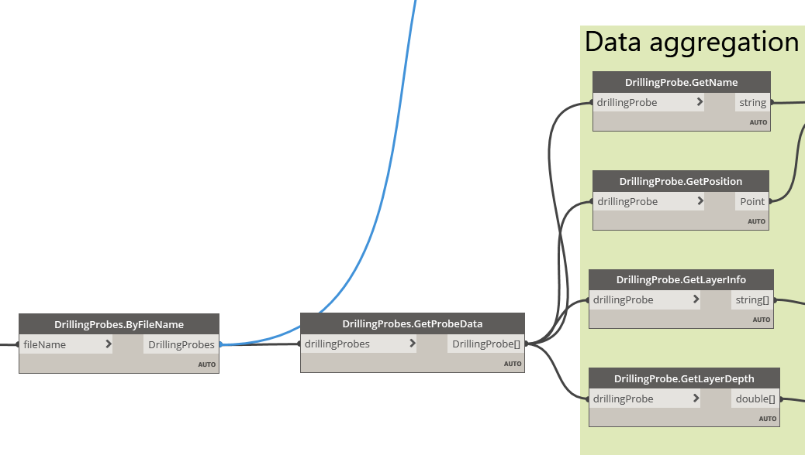

# IlseDynamo

Dynamo Customization Nodes 

## GGUStratic Data Nodes

__DrillingProbes__ 

Read and transform data of drilling probes given as GGUStratic XML files. The script will read an example and transfer the data to an Excel sheet wrapping soil layers into columns while storing each probe as a new row.

Example Dynamo file:
[GGU-Data-Export-Excel.dyn](IlseDynamo.Examples/GGU-Data-Export-Excel.dyn)

