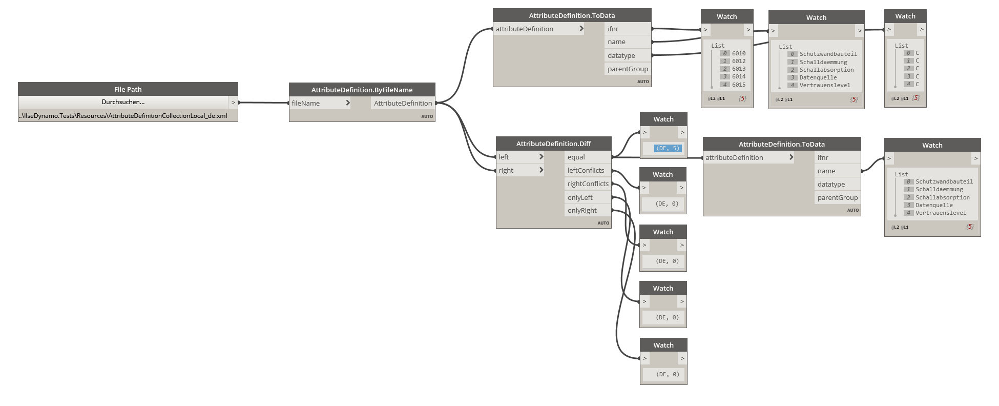

# IlseDynamo

An utility collection of Dynamo nodes wrapping repetitive tasks of several authoring tools in AEC.

## GGUStratig Nodes

__DrillingProbes__ 

Read and transform data of drilling probes given as GGUStratic XML files. The script will read an example and transfer the data to an Excel sheet wrapping soil layers into columns while storing each probe as a new row.

Example Dynamo file:
[GGU-Data-Export-Excel.dyn](IlseDynamo.Examples/GGU-Data-Export-Excel.dyn)

## Allplan Nodes

__AttributeDefinition__

 - Reading Allplan's local attribute definition schema
 - Merging, diffing and dumping definition data to data matrixes 

Example Dynamo file: [AllplanAttributeCollection-Example.dyn](IlseDynamo.Examples/AllplanAttributeCollection-Example.dyn)

{:width="600px"}

__AttributeFavourite__

 - Reading Allplan's local attribute favourite files (atfanfx - extension)
 - Resolving against attribute definition
 - Modifying favourites
 - Saving and dumping to data matrixes (i.e. for reporting)

Example Dynamo file: [AllplanAttributeFavourite-Example.dyn](IlseDynamo.Examples/AllplanAttributeFavourite-Example.dyn)

__AttributeLevel__ and __AttributeMatrix__

Those are custom nodes of wrapping Level-Of-Information concepts.

 - Reading/importing LOI definition (minimum LOI and attribute name)
 - Resolving against definition and favourites
 - Creating attribute favourites based on specific LOI level

Example Dynamo file: [AllplanAttributeLevel-Example.dyn](IlseDynamo.Examples/AllplanAttributeLevel-Example.dyn)